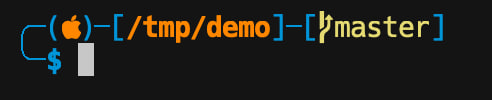
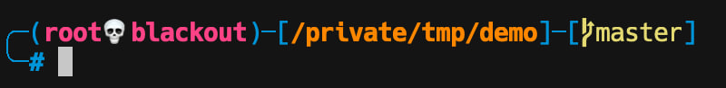
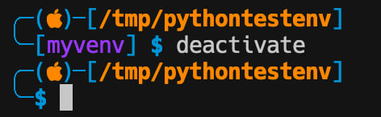
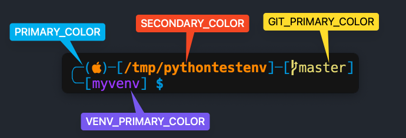

# machack.zsh-theme





# Requirements
**One of [Nerd Fonts](https://www.nerdfonts.com/) (tested on `Hack Nerd Font`)**

```shell
brew tap homebrew/cask-fonts &&
brew install --cask font-hack-nerd-font
```
**`virtualenv` plugin**
```
plugins=(virtualenv)
```

# Install
Copy `machack.zsh-theme` to `$ZSH_CUSTOM/themes` directory and set `ZSH_THEME=machack` in `~/.zshrc`

# Customization
Change the corresponding variables in the top of `machack.zsh-theme` file.

